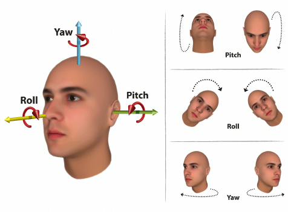

Biometric identification consists of determining the identity of a person. The aim is to capture an item of biometric data from this person. It can be a photo of their **face**, a record of their **voice**, or an image of their **fingerprint**. This data is then compared to the biometric data of several other persons kept in a database. In this mode, the question ​is simple: “Who are you?”

## Face Identification

To perform a face identification check and create a new enrolment if a duplicate is not found.

Send a HTTP POST request to:

- `/api/v1/id-verifications/basic/identify/face`

The following parameters are used for requests and responses:

| Parameter             | Direction | Description                                                                 |
|-----------------------|-----------|-----------------------------------------------------------------------------|
| sessionId             | request   | unique, short-lived code to be generated by the client to track specific sessions |
| subjectId             | request   | unique subject identifier in case enrolment is needed                       |
| faceImageBase         | request   | onboarded person photo, Base64 format or URL link to it                     |
| passiveLiveness       | request   | boolean parameter to perform/not perform passive liveness check, i.e. to detect if photo is genuine or a spoof |
| sessionId             | response  | unique, short-lived code to be generated by the client to track specific sessions. Same as in request |
| subjectId             | response  | unique subject identifier in case enrolment is needed. Same as in request   |
| hits                  | response  | array of persons reached identification threshold (i.e. “duplicates found”) |
| hits/subjectId        | response  | unique duplicate subject identifier                                         |
| hits/score            | response  | identification score of the subject. Higher score means higher matching level |
| hasError              | response  | boolean parameter - true - identification process ended up with some error; false - no errors |
| error                 | response  | error message in case of hasError set to true, informing about type of error: FACE_IMAGE_MISSING, INTERNAL_ERROR etc. |
| isUnique              | response  | boolean parameter - true - no hits; false - hits (matching person(s) were found) |
| passiveLivenessScore  | response  | numeric result of Passive Liveness check in range `[0;1]`, default threshold is 0.8 (i.e. less than 0.8 is a potential spoof) |

### Request:

```json
{
  "faceImageBase": "data:image/png;base64,/9j/4AAQSkZJRgABAQAAAQABAAD/2wBDAAIBAQEBAQIBAQECAgICAgQDAgICAgUEBAMEBgUGBgYFBgYGBwkIBgcJBwYGCAsICQoKCgoKBggLDAsKDAkKCgr...+SSyDCtmmrGoXzc8AcrURjKEjNOK6DII0ZyJFVgepUdKv26X0WVhuGcMPlBP3RVeFluDiNdvY8VbEUnO2UjaOTnrXoUZc8dTOdSUZEotL7A/eD/AL6oqVLJCoJmk6f3qKv2Rz+0if/Z",
  "sessionId": "bbbf9002-c3a2-4308-b103-d80b9f5a2b84",
  "subjectId": "John Doe-12345-23124",
  "passiveLiveness": true
}
```

### Response - passive liveness passed, no duplicates, person enrolled:
```json
{
  "sessionId": "bbbf9002-c3a2-4308-b103-d80b9f5a2b84",
  "subjectId": "John Doe-12345-23124",
  "passiveLivenessScore": 0.9997104,
  "isUnique": true,
  "hasError": false
}
```

### Response - passive liveness passed, duplicate found, no enrollment:
```json
{
  "sessionId": "bbbf9002-c3a2-4308-b103-d80b9f5a2b84",
  "subjectId": "John Doe-12345-23124",
  "passiveLivenessScore": 0.9997104,
  "isUnique": false,
  "hits": [
    {
      "subjectId": "John Smith-55555-23222",
      "score": 144
    }
  ],
  "hasError": false
}
```

### Response - passive liveness not passed:
```json
{
  "sessionId": "bbbf9002-c3a2-4308-b103-d80b9f5a2b84",
  "subjectId": "John Doe-12345-23124",
  "passiveLivenessScore": 2.1067458E-06,
  "hasError": false
}
```

### Response - error:
```json
{
  "sessionId": "bbbf9002-c3a2-4308-b103-d80b9f5a2b84",
  "hasError": true,
  "error": "`TOO_MANY_FACES`"
}
```

## List of errors

| Error                             | Description                                                                 |
|-----------------------------------|-----------------------------------------------------------------------------|
| `TOO_MANY_FACES`                    | More than one face on the image                                             |
| `FACE_TOO_CLOSE`                    | Face too close, distance to be increased                                    |
| `FACE_CLOSE_TO_BORDER`              | Face too close to border, face to be placed in the middle of the image      |
| `FACE_CROPPED`                      | Part of the face is not visible                                             |
| `FACE_IS_OCCLUDED`                  | Part of the face is covered by some object                                  |
| `FACE_NOT_FOUND`                    | Face not detected                                                           |
| `FACE_TOO_SMALL`                    | Face too close, distance to be decreased                                    |
| `FACE_ANGLE_TOO_LARGE`              | Yaw/pitch/roll angle is too big                                             |
| `ENROLMENT_REJECTED_SUBJECT_EXISTS` | The same subjectId sent for the enrolment. subjectId should be unique       |
| `ENROLMENT_REJECTED_DUPLICATE_FOUND`| Internal error, contact us                                                  |
| `ENROLMENT_REJECTED`                | Internal error, contact us                                                  |
| `IMAGE_INVALID`                     | Image broken                                                                |
| `ENROLL_ERROR`                      | Internal error, contact us                                                  |
| `IDENTIFY_ERROR`                    | Internal error, contact us                                                  |
| `INTERNAL_ERROR`                    | Internal error, contact us                                                  |

## Face Quality Requirements for Uncontrolled Face Capture

As biometrics is an inherently probabilistic operation, ensuring high quality images are sent to our API is important to achieve the best possible accuracy. Below is a description of the basic requirements for accurate biometric operation. Don’t worry - the system likely won’t return errors if some of these requirements are not exactly met; rather the accuracy will proportionally drop. If too many requirements are not met, the API may return an error message.

| Name            | Description                                                                 | Requirement          |
|-----------------|-----------------------------------------------------------------------------|----------------------|
| Pitch           | A face attribute representing the rotation angle of the head towards the camera reference frame around X-axis as per DIN9300. | ± 15 degrees         |
| Yaw             | A face attribute representing the rotation angle of the head towards the camera reference frame around Y-axis as per DIN9300. | ± 30 degrees         |
| Roll            | A face attribute representing the rotation angle of the head towards the camera reference frame around Z-axis as per DIN9300. | ± 15 degrees         |
| Eye Distance    | Distance between the eyes (interpupillary distance) in pixels.              | Minimum 80 pixels    |
| Face Size       | Number of pixels in the image consisting of the face.                       | Minimum 250 pixels   |
| Face Image Ratio| The percentage of the overall image taken up by the face.                   | Minimum 25%          |
| Max Faces       | The maximum number of faces present in the image.                           | 1                    |
| Padding         | The number of pixels between the edges of the face and the edge of the image. | Minimum 25 pixels    |
| Sunglasses      | Presence of sunglasses                                                     | Recommended to remove|
| Sharpness       | A face attribute for evaluating whether an area of the face image is blurred. | Avoid blur           |
| Fisheye lenses  | If the image was captured using a fisheye lens.                             | Not supported        |
| Brightness      | A face attribute for evaluating whether an area of the face is correctly exposed. | Capture in a well lit space |

