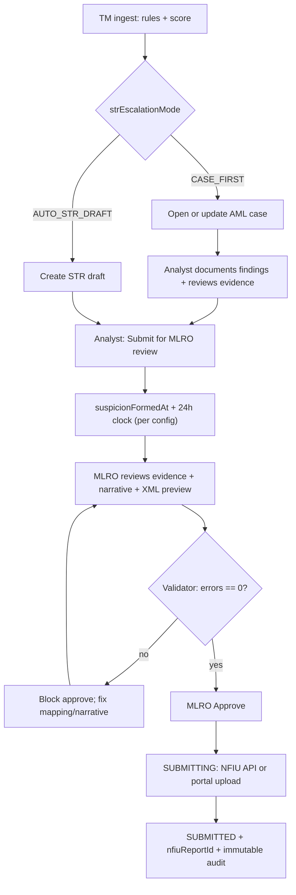

# Fraudspect — NFIU goAML / CBN Regulatory Reporting: End-to-End Implementation Prompt

> Copy everything below this line into Claude Code (or your agent session) and execute **phase by phase, in order**. Do not skip Phase 0 or Phase 1 — they unblock real client usage and XML validity.

**Companion docs (read first; this prompt supersedes overlapping sections but does not delete them):**

- [`doc/str-reporting-module-build-prompt.md`](./str-reporting-module-build-prompt.md) — original STR v1 build (mostly done)
- [`doc/str-cbn-production-compliance-prompt.md`](./str-cbn-production-compliance-prompt.md) — CBN phased roadmap (partial overlap)
- [`doc/str-reporting-flow-adjustments-prompt.md`](./str-reporting-flow-adjustments-prompt.md) — workflow tweaks
- [`doc/v2-monitoring.md`](./v2-monitoring.md) — org-scoped transaction field catalog migration

**NFIU reference assets (local):** `~/Downloads/goAMLSchemaguide.pdf`, `~/Downloads/LookupMaster.pdf`, `~/Downloads/webguide.pdf`, `~/Downloads/goAMLXValidator/`.
**Golden XML (accepted by portal):** `~/Downloads/_Web_Report_ReportID_2619207-0-0.xml` (CTR sample: `submission_code=E`, `transmode_code=C`, `from_funds_code=B`, `THRESHOLDREPORT`).

---

## Mission

Take Fraudspect's NFIU goAML reporting from **STR v1 (workflow shell)** to **production-grade, CBN-examination-ready regulatory reporting** for Nigerian financial institutions:

1. **AML investigation loop** — alert → case → evidence → filing decision → STR
2. **NFIU-valid goAML 5.0.2 XML** — correct LookupMaster codes, accounts, identifications, parent+sub indicators
3. **Pre-submit validation** — required-field + LookupMaster + (optional) XSD checks surfaced in `previewXml`
4. **Full report catalogue** — STR, CTR, FTR, SAR
5. **v2 transaction field catalog** — STR mappings on `TransactionFieldDefinition`, org-scoped rules
6. **Exam readiness** — MLRO checklist, evidence panel, filing-compliance dashboard, auditor export

**AI/LLM narrative generation is explicitly out of scope.** Use structured template drafts + mandatory human edit + MLRO gate.

---

## Current state (grounded in the actual code — do NOT rebuild what works)

### What exists and is correct

| Area | File | Status |
|------|------|--------|
| Auto-escalation | [`str-escalation.service.ts`](../backend/src/modules/str-reports/services/str-escalation.service.ts) | Works; upserts `OrganizationStrConfig`, links AML case |
| MLRO workflow + submit | [`str-reports.service.ts`](../backend/src/modules/str-reports/services/str-reports.service.ts), [`str-submission.processor.ts`](../backend/src/modules/str-reports/processors/str-submission.processor.ts) | Maker-checker gate enforced |
| Provider contract | [`str-provider.interface.ts`](../backend/src/modules/str-reports/providers/str-provider.interface.ts) | `requiresMlroApproval: true` locked |
| Field mapping (v2) | `StrFieldMapping.txnFieldDefinitionId` → `TransactionFieldDefinition` | Wired |
| Frontend STR | [`frontend/src/modules/str-reports/`](../frontend/src/modules/str-reports/) | Dashboard, detail, config, cards |

### What is wrong / missing (must fix)

| Problem | Evidence (real code) |
|---------|----------------------|
| **Funds code inverted** | [`nfiu-goaml.types.ts`](../backend/src/modules/str-reports/providers/nfiu-goaml/nfiu-goaml.types.ts) `FundsCode.CASH='B'` — NFIU LookupMaster: `B`=EFT, `K`=cash |
| **Transmode invented** | `TransmodeCode = { CASH:'C', WIRE_TRANSFER:'T', INTERNET:'W', ... }` — NFIU uses `conduction_type` (`C`, `k`, `A`, `B`, …) |
| **Indicators invented** | `GOAML_INDICATORS.DEFAULT='SUSPICIOUSTRANSACTION'` etc. — LookupMaster requires parent + ≥1 sub (e.g. `FraudScam` + `FraudScam-3`) |
| **Funds hardcoded** | [`nfiu-xml.builder.ts`](../backend/src/modules/str-reports/providers/nfiu-goaml/nfiu-xml.builder.ts) `buildFromNode` / `buildToNode` always emit `FundsCode.WIRE` |
| **Flat person ID** | builder emits `<id_number>` — schema wants `<identifications><identification><type/><number/><issue_country/></identification></identifications>` |
| **No accounts** | no `<from_account>` / `<to_account>` (institution_code, account, currency_code) |
| **Legal form / role hardcoded** | `LegalForm.PRIVATE_LIMITED` and `Gender.MALE` forced for every entity/director |
| **No `entity_reference` / `reason` / `rentity_branch`** | missing from report root |
| **No validation** | `previewXml` returns `{ xml }` only — no error/warning surface |
| **Clock at draft** | `str-escalation.service.ts` sets `suspicionFormedAt = new Date()` + 24h at draft creation, not at the MLRO filing decision |
| **`transactionId` required** | `model StrReport` in [`schema.prisma`](../backend/prisma/schema.prisma) — blocks SAR (non-transactional) |
| **No CTR/FTR/SAR escalation** | only `StrEscalationService` exists |
| **No investigation evidence** | `AmlCase` has no notes; STR detail shows case as chip only |

### Coverage scorecard (baseline)

| Layer | Coverage |
|-------|----------|
| STR workflow | ~85% |
| goAML XML validity | ~40% |
| LookupMaster fidelity | ~20% |
| In-app validation | 0% |
| CTR/SAR/FTR | ~15% |
| AML investigation integration | ~25% |
| CBN exam readiness | ~20% |

---

## Locked regulatory decisions (do not change)

| Decision | Choice |
|----------|--------|
| MLRO before NFIU submit | **Always** (`requiresMlroApproval: true`) — never configurable for NFIU |
| STR filing window | 24h from `suspicionFormedAt`; **start event configurable** (see Phase 2) |
| CTR window | 7 days (`CTR_FILING_WINDOW_HOURS = 168`) unless NFIU confirms same-day only |
| CTR thresholds | Individual cash ≥ ₦5,000,000; corporate ≥ ₦10,000,000 |
| CTR indicator | `THRESHOLDREPORT` only; no `suspicious_activity` block |
| STR indicators | LookupMaster parent + ≥1 sub-indicator |
| `submission_code` | `E` (electronic) |
| Submission | API when `apiEndpoint` configured; else honest `PENDING_PORTAL_UPLOAD` |
| AI narratives | Not required; out of scope |
| Tipping off | Never notify the customer of an STR; no customer-facing STR events |

---

## Architecture principles (all phases)

1. **Extend the `str-reports` module.** Keep the API path `/str-reports`. Internal rename to `regulatory-reports` is optional and not required.
2. **Provider pattern stays.** `StrSubmissionProvider` with `NFIU_GOAML` first. Report-type differences (STR/CTR/FTR/SAR) live in separate escalation services that share one XML builder.
3. **LookupMaster is the single source of truth** for every enumerated code. No invented strings anywhere.
4. **Field catalog v2.** Map via `StrFieldMapping.txnFieldDefinitionId` → `TransactionFieldDefinition` (not `ModuleApiRequestFieldDefinition`).
5. **Frontend conventions** (`frontend/CLAUDE.md`): Tailwind first, `div` over `Box`, `LoadingButton` for async, `features/` own data-fetching, RTK Query results assigned to a named variable (never destructured at call site).
6. **Backend conventions** (`backend/CLAUDE.md`): thin controllers, `@Response()` decorator, `prisma.tenancy` for org-scoped access, no silent swallow in processors.

---

## End-to-end target flow



CTR runs a parallel cash-threshold path; SAR runs a case-led path with no required transaction.

---

# PHASE 0 — Foundations (P0)

**Goal:** Reference data, schema flags, no breaking changes.

## 0.1 NFIU reference assets in repo

```
doc/nfiu/
  LookupMaster.pdf
  goAMLSchemaguide.pdf
  webguide.pdf
  samples/
    ctr-portal-accepted.xml   # copy of _Web_Report_ReportID_2619207-0-0.xml
```

Add to `.gitignore` if PDFs are large; keep the XML sample committed for golden-file tests.

## 0.2 LookupMaster constants

**New:** `backend/src/modules/str-reports/constants/nfiu-lookup-master.constant.ts`

```typescript
/**
 * NFIU goAML LookupMaster codes (extracted from LookupMaster.pdf).
 * These are the ONLY valid enumeration values for outbound XML.
 * Every code emitted by NfiuXmlBuilder MUST exist in one of these maps.
 */

/** report_code */
export const NFIU_REPORT_TYPE = {
  STR: 'STR',
  CTR: 'CTR',
  FTR: 'FTR',
  SAR: 'SAR',
} as const;

/** funds_type — from_funds_code / to_funds_code. NFIU: B=EFT, K=Cash. */
export const NFIU_FUNDS_TYPE = {
  EFT: 'B',
  CASH: 'K',
  CHEQUE: 'P',
  OTHER: 'Z',
} as const;

/** conduction_type — emitted as <transmode_code>. */
export const NFIU_CONDUCTION_TYPE = {
  CASH: 'C',
  CARD: 'k',
  ATM: 'A',
  BANK_TRANSFER: 'B',
  OTHER: 'Z',
} as const;

/** identifier_type — person/entity identification <type>. */
export const NFIU_IDENTIFIER_TYPE = {
  NATIONAL_ID: 'B', // NIN
  PASSPORT: 'C',
  DRIVERS_LICENSE: 'D',
  BVN: 'L',
  OTHER: 'Z',
} as const;

/** legal_form_type — incorporation_legal_form. */
export const NFIU_LEGAL_FORM = {
  LLC: 'A',
  PLC: 'B',
  PARTNERSHIP: 'C',
  SOLE_PROPRIETOR: 'D',
  ORDINARY_BUSINESS: 'G',
  GOVERNMENT: 'E',
  OTHER: 'Z',
} as const;

/** entity_person_role_type — entity_related_person <role>. */
export const NFIU_ENTITY_PERSON_ROLE = {
  DIRECTOR: 'A',
  SHAREHOLDER: 'B',
  SIGNATORY: 'C',
  BENEFICIAL_OWNER: 'D',
  OTHER: 'Z',
} as const;

/**
 * report_indicator_type — STR requires a parent code plus at least one
 * sub-indicator. Sub-indicators follow the `<Parent>-<n>` convention.
 * Verify the exact parents/subs against LookupMaster.pdf before shipping.
 */
export const NFIU_INDICATOR_PARENT = {
  FRAUD_SCAM: 'FraudScam',
  MONEY_LAUNDERING: 'MoneyLaund',
  TERRORISM: 'TerFinance',
  PEP: 'PEPtr',
  THRESHOLD: 'THRESHOLDREPORT',
} as const;

export const NFIU_INDICATOR_SUB = {
  FRAUD_SCAM_GENERIC: 'FraudScam-3',
  STRUCTURING: 'MoneyLaund-2',
  LAYERING: 'MoneyLaund-5',
} as const;

export type NfiuLookupTable =
  | 'report_type'
  | 'funds_type'
  | 'conduction_type'
  | 'identifier_type'
  | 'legal_form_type'
  | 'entity_person_role_type'
  | 'report_indicator_type';

export const NFIU_LOOKUP_SETS: Record<NfiuLookupTable, Set<string>> = {
  report_type: new Set(Object.values(NFIU_REPORT_TYPE)),
  funds_type: new Set(Object.values(NFIU_FUNDS_TYPE)),
  conduction_type: new Set(Object.values(NFIU_CONDUCTION_TYPE)),
  identifier_type: new Set(Object.values(NFIU_IDENTIFIER_TYPE)),
  legal_form_type: new Set(Object.values(NFIU_LEGAL_FORM)),
  entity_person_role_type: new Set(Object.values(NFIU_ENTITY_PERSON_ROLE)),
  report_indicator_type: new Set([
    ...Object.values(NFIU_INDICATOR_PARENT),
    ...Object.values(NFIU_INDICATOR_SUB),
  ]),
};
```

**New:** `backend/src/modules/str-reports/services/nfiu-lookup-validator.service.ts`

```typescript
import { Injectable } from '@nestjs/common';
import { NFIU_LOOKUP_SETS, NfiuLookupTable } from '../constants/nfiu-lookup-master.constant';

export interface LookupIssue {
  table: NfiuLookupTable;
  value: string;
  field: string;
}

@Injectable()
export class NfiuLookupValidatorService {
  isValid(table: NfiuLookupTable, value: string | undefined | null): boolean {
    if (value == null || value === '') return false;
    return NFIU_LOOKUP_SETS[table].has(value);
  }

  /** Returns an issue when the value is not a valid LookupMaster code, else null. */
  check(table: NfiuLookupTable, value: string | undefined | null, field: string): LookupIssue | null {
    return this.isValid(table, value) ? null : { table, value: String(value ?? ''), field };
  }
}
```

## 0.3 Prisma schema additions

Append to `OrganizationStrConfig`, `StrReport`, and add `AmlCaseNote`. Generate a migration with `yarn create-migration`.

```prisma
enum StrEscalationMode {
  AUTO_STR_DRAFT   // current behaviour
  CASE_FIRST       // open/update case only; analyst files STR manually
}

enum SuspicionClockEvent {
  AUTO_ESCALATION
  ANALYST_SUBMIT_FOR_REVIEW
  MLRO_APPROVE
}

enum NfiuEnvironment {
  SANDBOX
  PRODUCTION
}

// ── OrganizationStrConfig additions ──
//   rentityBranch          String?
//   strEscalationMode      StrEscalationMode   @default(AUTO_STR_DRAFT)
//   suspicionClockStartsAt SuspicionClockEvent @default(ANALYST_SUBMIT_FOR_REVIEW)
//   nfiuEnvironment        NfiuEnvironment     @default(SANDBOX)
//   ctrEnabled             Boolean  @default(true)
//   ctrIndividualThreshold Decimal  @default(5000000) @db.Decimal(20, 2)
//   ctrCorporateThreshold  Decimal  @default(10000000) @db.Decimal(20, 2)
//   indicatorMappings      Json?    // optional org override: rule pattern -> { parent, subs[] }
//   strBlockApproveOnValidationErrors Boolean @default(true) // gates MLRO approve (see Phase 1.7)

// ── StrReport additions ──
//   entityReference        String?   // unique per filing (org sequence or report id)
//   suspicionDecisionAt    DateTime? // when filing intent was recorded
//   mlroReviewChecklist    Json?     // persisted on approve
//   validationErrors       Json?     // last preview validation snapshot
//   customerId             Int?      // required for SAR when transactionId is null
//   transactionId          String?   // CHANGE: make nullable for SAR (was required)
//
// NOTE: the existing `transaction` relation is currently required:
//     transaction  Transaction  @relation(fields: [transactionId], references: [id])
// Change BOTH sides to optional:
//     transactionId String?
//     transaction   Transaction? @relation(fields: [transactionId], references: [id])
// Add the customer relation used by SAR:
//     customerId    Int?
//     customer      Customer?    @relation(fields: [customerId], references: [id])

model AmlCaseNote {
  id         String   @id @default(uuid())
  amlCaseId  String
  authorId   String?
  body       String   @db.Text
  createdAt  DateTime @default(now())
  amlCase    AmlCase  @relation(fields: [amlCaseId], references: [id], onDelete: Cascade)
  author     User?    @relation(fields: [authorId], references: [id])

  @@index([amlCaseId])
}

// Required back-relations (Prisma needs both sides of every relation):
//   model AmlCase { ... notes AmlCaseNote[] }
//   model User    { ... amlCaseNotes AmlCaseNote[] }
```

> **Migration safety:** Making `StrReport.transactionId` nullable is backward compatible (existing rows keep their value). Add a service-level invariant: `transactionId` XOR `customerId` must be present, enforced in `create`.

> **No enum churn needed yet:** `StrReportStatus` already includes `PENDING_PORTAL_UPLOAD`, and `StrSubmissionMode` already exists as `PORTAL_UPLOAD | API_DIRECT` — do NOT redefine them. `StrReportType` is currently `STR | CTR | SAR`; **FTR is NOT present** and must be added before Phase 4 (see Phase 4).

## 0.4 Wire the compliance provisioner

Ensure `OrgComplianceProvisionerService.provision(orgId)` runs on every org-create path (admin create + signup). STR config upsert in `StrEscalationService` already exists — keep it as a fallback.

## 0.5 Permissions

Confirm both apps expose: `STR_READ`, `STR_WRITE`, `STR_MLRO_APPROVE`, `STR_CONFIG`. Reuse `STR_WRITE` for CTR/SAR drafting with report-type checks in the service layer.

### Phase 0 acceptance
- [ ] `nfiu-lookup-master.constant.ts` compiles; unit test asserts a sample of codes from the PDF.
- [ ] Migration applied; existing STRs untouched; `transactionId` nullable.
- [ ] New orgs receive v2 field defs + STR config + default mappings.

---

# PHASE 1 — NFIU-valid STR XML + validation (P0)

**Goal:** Generated STR XML passes the goAMLXValidator / portal validator.

## 1.1 Replace the enums

Rewrite `backend/src/modules/str-reports/providers/nfiu-goaml/nfiu-goaml.types.ts` to re-export from LookupMaster constants. Remove the inverted/invented values.

```typescript
export const GOAML_SCHEMA_VERSION = '5.0.2';
export const GOAML_SUBMISSION_CODE = 'E';
export const GOAML_CURRENCY_LOCAL = 'NGN';
export const GOAML_COUNTRY_CODE = 'NG';

export {
  NFIU_FUNDS_TYPE as FundsCode,
  NFIU_CONDUCTION_TYPE as ConductionCode,
  NFIU_IDENTIFIER_TYPE as IdentifierType,
  NFIU_LEGAL_FORM as LegalForm,
  NFIU_ENTITY_PERSON_ROLE as EntityRelatedPersonRole,
} from '../../constants/nfiu-lookup-master.constant';

export const AddressType = { BUSINESS: 'B', HOME: 'H', OTHER: 'O' } as const;
export const PhoneContactType = { BUSINESS: 'B', HOME: 'H', MOBILE: 'M' } as const;
export const Gender = { MALE: 'M', FEMALE: 'F' } as const;
```

> Delete the old `GOAML_INDICATORS` record — indicator resolution moves to `StrIndicatorResolverService` (1.4).

## 1.2 Expand the canonical field keys

Add to `GOAML_FIELD` in [`goaml-fields.constant.ts`](../backend/src/modules/str-reports/constants/goaml-fields.constant.ts) (and add matching `GOAML_FIELD_META` entries):

```typescript
  // Person identification
  PERSON_ID_TYPE: 'person.id_type',
  PERSON_ID_ISSUE_COUNTRY: 'person.id_issue_country',
  PERSON_BVN: 'person.bvn',
  PERSON_NIN: 'person.nin',

  // Accounts
  FROM_INSTITUTION_CODE: 'account.from_institution_code',
  FROM_ACCOUNT_NUMBER: 'account.from_number',
  FROM_ACCOUNT_CURRENCY: 'account.from_currency',
  TXN_BENEFICIARY_INSTITUTION: 'account.to_institution_code',
  TXN_BENEFICIARY_CURRENCY: 'account.to_currency',

  // Transaction / report
  TXN_CONDUCTION: 'transaction.conduction',     // -> transmode_code
  TXN_FROM_FUNDS: 'transaction.from_funds_code',
  TXN_TO_FUNDS: 'transaction.to_funds_code',
  REPORT_REASON: 'report.reason',
  REPORT_ENTITY_REFERENCE: 'report.entity_reference',
```

Update `compliance-template.seeder.ts` defaults: customer `bvn`, `nin`, `id_type`; transaction `channel` → conduction alias.

## 1.3 Rewrite the builder branches

In [`nfiu-xml.builder.ts`](../backend/src/modules/str-reports/providers/nfiu-goaml/nfiu-xml.builder.ts):

**Report root** — add `entity_reference`, `reason`, optional `rentity_branch`:

```typescript
return [
  '<?xml version="1.0" encoding="UTF-8"?>',
  '<report>',
  `<schema_version>${GOAML_SCHEMA_VERSION}</schema_version>`,
  `<rentity_id>${xmlEscape(rentityId)}</rentity_id>`,
  rentityBranch ? `<rentity_branch>${xmlEscape(rentityBranch)}</rentity_branch>` : '',
  `<submission_code>${GOAML_SUBMISSION_CODE}</submission_code>`,
  `<report_code>${xmlEscape(report.reportType)}</report_code>`,
  `<entity_reference>${xmlEscape(report.entityReference ?? report.id)}</entity_reference>`,
  `<report_date>${isoDateTime(submittedAt)}</report_date>`,
  `<currency_code_local>${GOAML_CURRENCY_LOCAL}</currency_code_local>`,
  `<reporting_user_code>${xmlEscape(reportingUserCode)}</reporting_user_code>`,
  reason ? `<reason>${xmlEscape(reason)}</reason>` : '',
  transactionNode,
  `<report_indicators>${indicatorNodes}</report_indicators>`,
  '</report>',
].filter(Boolean).join('');
```

**Person identifications** — replace the flat `<id_number>`:

```typescript
private buildIdentifications(
  custMappedFields: any[],
  fieldMappings: FieldMappingRow[],
): string {
  const R = (key: string, ...aliases: string[]) =>
    resolveExplicitOrAlias(key, fieldMappings, [], custMappedFields, ...aliases);

  const bvn = R(GOAML_FIELD.PERSON_BVN, 'bvn');
  const nin = R(GOAML_FIELD.PERSON_NIN, 'nin', 'nationalId');
  const issueCountry = R(GOAML_FIELD.PERSON_ID_ISSUE_COUNTRY, 'idIssueCountry') || GOAML_COUNTRY_CODE;

  const ids: string[] = [];
  if (bvn) ids.push(this.identification(IdentifierType.BVN, bvn, issueCountry));
  if (nin) ids.push(this.identification(IdentifierType.NATIONAL_ID, nin, issueCountry));
  return ids.length ? `<identifications>${ids.join('')}</identifications>` : '';
}

private identification(type: string, number: string, issueCountry: string): string {
  return [
    '<identification>',
    `<type>${type}</type>`,
    `<number>${xmlEscape(number)}</number>`,
    `<issue_country>${xmlEscape(issueCountry)}</issue_country>`,
    '</identification>',
  ].join('');
}
```

**Accounts + funds + conduction** — resolve real codes, never hardcode:

```typescript
private resolveFunds(raw: string | undefined): string {
  const v = (raw ?? '').toLowerCase();
  if (v.includes('cash')) return FundsCode.CASH;   // 'K'
  if (v.includes('cheque') || v.includes('check')) return FundsCode.CHEQUE;
  return FundsCode.EFT;                              // 'B' default
}

private resolveConduction(raw: string | undefined): string {
  const v = (raw ?? '').toLowerCase();
  if (v.includes('cash')) return ConductionCode.CASH;          // 'C'
  if (v.includes('card') || v.includes('pos')) return ConductionCode.CARD; // 'k'
  if (v.includes('atm')) return ConductionCode.ATM;            // 'A'
  if (v.includes('transfer') || v.includes('wire') || v.includes('eft'))
    return ConductionCode.BANK_TRANSFER;                       // 'B'
  return ConductionCode.OTHER;
}

private buildFromAccount(custMappedFields: any[], fieldMappings: FieldMappingRow[]): string {
  const R = (k: string, ...a: string[]) =>
    resolveExplicitOrAlias(k, fieldMappings, [], custMappedFields, ...a);
  const institution = R(GOAML_FIELD.FROM_INSTITUTION_CODE, 'bankCode', 'institutionCode');
  const account = R(GOAML_FIELD.FROM_ACCOUNT_NUMBER, 'accountNumber', 'account');
  const currency = R(GOAML_FIELD.FROM_ACCOUNT_CURRENCY, 'currency') || GOAML_CURRENCY_LOCAL;
  if (!account) return '';
  return [
    '<from_account>',
    institution ? `<institution_code>${xmlEscape(institution)}</institution_code>` : '',
    `<account>${xmlEscape(account)}</account>`,
    `<currency_code>${xmlEscape(currency)}</currency_code>`,
    '</from_account>',
  ].filter(Boolean).join('');
}
```

Then in `buildFromNode` use `this.resolveFunds(...)` for `from_funds_code`, insert `buildFromAccount(...)`, and emit `buildIdentifications(...)` inside `<from_person>`. Replace the hardcoded `LegalForm.PRIVATE_LIMITED` with a resolved legal-form code, and `Gender.MALE` for directors with a resolved gender (default only when unknown, and log a warning so it surfaces in validation).

## 1.4 Indicator resolver

**New:** `backend/src/modules/str-reports/services/str-indicator-resolver.service.ts`

```typescript
import { Injectable } from '@nestjs/common';
import {
  NFIU_INDICATOR_PARENT as P,
  NFIU_INDICATOR_SUB as S,
} from '../constants/nfiu-lookup-master.constant';

export interface ResolvedIndicators {
  parents: string[];
  subs: string[];
}

@Injectable()
export class StrIndicatorResolverService {
  /**
   * Maps fired rule names + screening flags to LookupMaster indicator codes.
   * STR requires at least one parent and one sub-indicator.
   */
  resolve(ruleNames: string[], opts?: { pep?: boolean; sanctions?: boolean }): ResolvedIndicators {
    const parents = new Set<string>();
    const subs = new Set<string>();

    if (opts?.pep) parents.add(P.PEP);
    if (opts?.sanctions) { parents.add(P.MONEY_LAUNDERING); subs.add(S.LAYERING); }

    for (const name of ruleNames.map((n) => n.toLowerCase())) {
      if (name.includes('struct')) { parents.add(P.MONEY_LAUNDERING); subs.add(S.STRUCTURING); }
      else if (name.includes('layer')) { parents.add(P.MONEY_LAUNDERING); subs.add(S.LAYERING); }
      else if (name.includes('fraud') || name.includes('scam')) { parents.add(P.FRAUD_SCAM); subs.add(S.FRAUD_SCAM_GENERIC); }
    }

    // Guarantee a valid STR shape.
    if (parents.size === 0) { parents.add(P.FRAUD_SCAM); subs.add(S.FRAUD_SCAM_GENERIC); }
    if (subs.size === 0) subs.add(S.FRAUD_SCAM_GENERIC);

    return { parents: [...parents], subs: [...subs] };
  }
}
```

The builder emits one `<indicator>` per parent and per sub. Allow org override via `OrganizationStrConfig.indicatorMappings`.

## 1.5 BVN validator

**New:** `backend/src/modules/str-reports/helpers/bvn.validator.ts`

```typescript
export function isValidBvn(value: string | undefined | null): boolean {
  return typeof value === 'string' && /^\d{11}$/.test(value.trim());
}

export function isValidNin(value: string | undefined | null): boolean {
  return typeof value === 'string' && /^\d{11}$/.test(value.trim());
}
```

## 1.6 goAML validation service

**New:** `backend/src/modules/str-reports/services/goaml-validation.service.ts`

```typescript
import { Injectable } from '@nestjs/common';
import { NfiuLookupValidatorService } from './nfiu-lookup-validator.service';
import { isValidBvn } from '../helpers/bvn.validator';

export interface ValidationIssue {
  code: string;
  message: string;
  path?: string;
}
export interface GoamlValidationResult {
  errors: ValidationIssue[];
  warnings: ValidationIssue[];
}

@Injectable()
export class GoamlValidationService {
  constructor(private readonly lookup: NfiuLookupValidatorService) {}

  /**
   * Business-rule validation over the resolved field bundle the builder uses.
   * XSD validation (optional) can be layered with libxmljs2-xsd against the
   * NFIU 5.0.2 schema in doc/nfiu/.
   */
  validate(input: {
    reportType: string;
    transmodeCode?: string;
    fromFundsCode?: string;
    indicatorParents: string[];
    indicatorSubs: string[];
    bvn?: string;
    amountLocal?: number;
    hasFromParty: boolean;
  }): GoamlValidationResult {
    const errors: ValidationIssue[] = [];
    const warnings: ValidationIssue[] = [];

    const push = (issue: ReturnType<NfiuLookupValidatorService['check']>, code: string) => {
      if (issue) errors.push({ code, message: `Invalid ${issue.table} code "${issue.value}"`, path: issue.field });
    };

    push(this.lookup.check('report_type', input.reportType, 'report_code'), 'INVALID_REPORT_TYPE');
    push(this.lookup.check('conduction_type', input.transmodeCode, 'transmode_code'), 'INVALID_TRANSMODE');
    push(this.lookup.check('funds_type', input.fromFundsCode, 'from_funds_code'), 'INVALID_FUNDS');

    if (input.reportType === 'STR') {
      if (input.indicatorParents.length === 0)
        errors.push({ code: 'MISSING_INDICATOR_PARENT', message: 'STR requires at least one parent indicator' });
      if (input.indicatorSubs.length === 0)
        errors.push({ code: 'MISSING_INDICATOR_SUB', message: 'STR requires at least one sub-indicator' });
    }

    if (!input.hasFromParty)
      errors.push({ code: 'MISSING_FROM_PARTY', message: 'Transaction has no originating party' });

    if (!input.amountLocal || input.amountLocal <= 0)
      errors.push({ code: 'INVALID_AMOUNT', message: 'amount_local must be greater than 0' });

    if (input.bvn && !isValidBvn(input.bvn))
      warnings.push({ code: 'BVN_FORMAT', message: 'BVN should be 11 digits', path: 'identification.number' });

    return { errors, warnings };
  }
}
```

## 1.7 Change `previewXml` and block approve on errors

In [`str-reports.service.ts`](../backend/src/modules/str-reports/services/str-reports.service.ts) change the return type:

```typescript
async previewXml(
  user: User,
  id: string,
): Promise<{ xml: string; validation: GoamlValidationResult }> {
  // ...existing load + context build...
  const xml = this.nfiuProvider.buildXml(report as any, context, fieldMappings);
  const validation = this.goamlValidation.validate(/* resolved bundle from builder */);
  await this.rawPrisma.strReport.update({
    where: { id },
    data: { validationErrors: validation.errors as any },
  });
  return { xml, validation };
}
```

In `approve()`, before transition, reload the latest validation and reject when blocking errors exist (default on):

```typescript
if (config.strBlockApproveOnValidationErrors !== false) {
  const { validation } = await this.previewXml(user, id);
  if (validation.errors.length > 0) {
    throw new BadRequestException(
      `Cannot approve: ${validation.errors.length} validation error(s) must be resolved first`,
    );
  }
}
```

> Have the builder expose a `buildWithBundle()` that returns `{ xml, bundle }` so the validator receives exactly the resolved codes used in the XML (avoids drift).

> **`config.strBlockApproveOnValidationErrors`** is a NEW field on `OrganizationStrConfig` (declared in Phase 0.3, `Boolean @default(true)`). The `!== false` check above keeps the gate on by default even before any org sets it.

**Frontend (non-breaking):** the existing endpoint is typed `ApiResponse<{ xml: string }>` in [`strReportApi.ts`](../frontend/src/apis/strReportApi.ts) and the UI reads `resp?.data?.xml` in [`StrReportDetails.tsx`](../frontend/src/modules/str-reports/pages/StrReportDetails.tsx). Widen the type so the validation panel can read errors — old code keeps working:

```typescript
previewStrXml: builder.mutation<
  ApiResponse<{ xml: string; validation: { errors: ValidationIssue[]; warnings: ValidationIssue[] } }>,
  ApiRequestConfig<void, void, { id: string }>
>({ /* unchanged */ }),
```

## 1.8 Tests

- `nfiu-xml.builder.spec.ts` — golden fixtures `str-individual-eft.fixture.ts`, `str-entity-cash.fixture.ts`; assert `<identifications>`, `<from_account>`, correct funds/conduction.
- `goaml-validation.service.spec.ts` — invalid codes produce errors; valid STR passes.
- `str-indicator-resolver.service.spec.ts` — every output is in `NFIU_LOOKUP_SETS.report_indicator_type`.

### Phase 1 acceptance
- [ ] `previewXml` returns `{ xml, validation }`; UI shows errors/warnings.
- [ ] MLRO approve blocked when errors > 0.
- [ ] A real-org STR passes goAMLXValidator (manual Windows sign-off) or the portal validator.
- [ ] No invented codes remain anywhere in the builder.

---

# PHASE 2 — AML investigation integration (P0)

**Goal:** Match the regulator's "investigate → decide → file" model, not "score → draft".

## 2.1 Escalation mode

`OrganizationStrConfig.strEscalationMode`:
- `AUTO_STR_DRAFT` — current behaviour (keep for backward compat).
- `CASE_FIRST` — on trigger, create/update the AML case and notify the analyst; **do not** create an STR until a human files it.

In [`str-escalation.service.ts`](../backend/src/modules/str-reports/services/str-escalation.service.ts), branch on the mode after the trigger check.

## 2.2 AML case investigation notes

- **Backend:** `POST /aml-cases/:id/notes`, `GET /aml-cases/:id/notes` backed by `AmlCaseNote`.
- **Frontend:** `frontend/src/modules/case/features/AmlCaseInvestigationNotes.tsx` (own query + `LoadingButton` to add note).

## 2.3 Suspicion-clock policy

`OrganizationStrConfig.suspicionClockStartsAt` drives when `suspicionFormedAt` + `filingDeadlineAt` are set:

- `ANALYST_SUBMIT_FOR_REVIEW` → set in `submitForReview()` (recommended default).
- `MLRO_APPROVE` → set in `approve()`.
- `AUTO_ESCALATION` → current behaviour.

Do **not** reset the clock on narrative edits. Record `suspicionDecisionAt` on the chosen event. Stop setting the clock unconditionally at draft creation when mode is not `AUTO_ESCALATION`.

## 2.4 Evidence panel

**New:** `frontend/src/modules/str-reports/features/StrReportEvidencePanel.tsx` — parallel queries for transaction + fired rules, customer + mapped fields (highlight BVN/NIN), latest screening (PEP/sanctions), linked AML case + notes, other transactions on the case.

**Backend:** add `GET /str-reports/:id/evidence` aggregator to avoid N+1.

## 2.5 Enriched narrative template

Extend [`str-narrative.builder.ts`](../backend/src/modules/str-reports/helpers/str-narrative.builder.ts) to accept an evidence bundle and produce sectioned text:

```
1. Summary of suspicion
2. Customer profile (name, BVN/NIN, account)
3. Transaction details (amount, date, channel, counterparty)
4. Red flags / rules triggered
5. Investigation findings
6. Why suspicion could not be dispelled
```

Still require a human edit before MLRO review (keep the minimum-length guard).

## 2.6 MLRO checklist

**New:** `frontend/src/modules/str-reports/features/StrReportMlroChecklist.tsx` — all items required to enable Approve:
- [ ] Narrative describes specific grounds for suspicion
- [ ] Transaction and customer evidence reviewed
- [ ] XML preview reviewed; validation errors resolved
- [ ] Correct report indicators selected
- [ ] No tipping off

Persist `mlroReviewChecklist` JSON on `StrReport` and as an `StrReportEvent` on approve.

### Phase 2 acceptance
- [ ] `CASE_FIRST` creates a case without an STR.
- [ ] STR detail shows the evidence panel.
- [ ] Narrative draft includes rules + screening context.
- [ ] MLRO cannot approve with unchecked items or validation errors.
- [ ] Clock starts per config on the correct event.

---

# PHASE 3 — CTR (P1)

## 3.1 `CtrEscalationService`

**New:** `backend/src/modules/str-reports/services/ctr-escalation.service.ts` — listens to the same scored event; logic:

```
IF conduction/funds indicates CASH
AND amount >= threshold(individual | corporate based on customer type)
AND no active CTR exists for this transaction
THEN create StrReport { reportType: CTR, status: DRAFT, filingDeadlineAt: now + 168h }
```

Reuse `isEntityCustomer` to pick the individual vs corporate threshold.

## 3.2 CTR XML branch

In the builder: `report_code=CTR`, `report_indicators` = `THRESHOLDREPORT` only, no `suspicious_activity`, `reason` optional (the portal CTR sample omits it), funds/conduction resolved per transaction. Validate against `doc/nfiu/samples/ctr-portal-accepted.xml`.

## 3.3 CTR UI

`CtrReportCard` on the transaction detail (or extend `TransactionStrReportCard` with a report-type filter). Lighter governance: `ctrRequiresMlroApproval` (default `false`, confirm with legal) → compliance sign-off instead of full MLRO.

### Phase 3 acceptance
- [ ] Cash txn ≥ threshold creates a CTR draft.
- [ ] CTR XML matches the accepted portal sample structure.
- [ ] CTR validates with `THRESHOLDREPORT` only.

---

# PHASE 4 — FTR / cross-border (P1)

Confirm with NFIU whether FTR is a separate `report_code` or bundled under CTR.

- **Schema first:** the `StrReportType` enum is currently `STR | CTR | SAR`. Add `FTR` and migrate:

```prisma
enum StrReportType {
  STR
  CTR
  SAR
  FTR // cross-border / foreign transaction report
}
```

- **Detection:** foreign-currency or cross-border flag on the field catalog; threshold USD 10,000 equivalent (use org primary currency + exchange-rate service).
- **XML:** `report_code=FTR`, foreign-amount nodes per Schema Guide §4.7, indicator `THRESHOLDREPORT`.

---

# PHASE 5 — SAR (P2)

- **Schema (done in Phase 0):** `StrReport.transactionId` nullable, `customerId` required when no transaction.
- **`SarEscalationService` / manual file from AML case only.**
- **XML:** `activity` node (Schema Guide §3.3) with `report_parties`; no mandatory single `<transaction>`.
- **UI:** file SAR from `CaseDetails` without a transaction picker; SAR indicators from the case typology.

---

# PHASE 6 — v2 transaction field catalog (P1, parallel after Phase 0)

Follow [`doc/v2-monitoring.md`](./v2-monitoring.md):

1. Run `compliance:migrate-org` per org (dry-run first).
2. Point `StrFieldMapping` at `TransactionFieldDefinition` (already supported by `txnFieldDefinitionId`).
3. Org-scoped `Rule` + ingest scoped to org.
4. Frontend transaction-field-definitions admin UI.
5. Flip `OrganizationComplianceFeatures.transactionFieldsV2`.

STR-specific: re-seed default mappings after migration; verify `amount`, `from_account`, `beneficiary_account`, `conduction`, `channel` aliases.

---

# PHASE 7 — Exam readiness & operations (P2)

## 7.1 Filing-compliance dashboard

**New:** `frontend/src/modules/str-reports/pages/StrComplianceDashboard.tsx` — on-time STR % (30/90d), overdue / due-in-4h, rejected/failed, CTR backlog, mean time suspicion→submit.
**Backend:** `GET /str-reports/analytics/filing-compliance`.

## 7.2 Auditor export

`POST /str-reports/export/filing-log` — CSV/PDF: report id, type, suspicionAt, submittedAt, MLRO, nfiuRef, status.

## 7.3 Immutability & retention

5-year retention; soft-delete only; block mutation after `SUBMITTED` (`archivedAt`); never delete XML URLs or events.

## 7.4 Sandbox certification

**New:** `StrSandboxCertification.tsx` — track 20 STR + 10 CTR test submissions checklist.

## 7.5 Environment enforcement

`nfiuEnvironment`: `SANDBOX` uses only `sandboxApiEndpoint`; `PRODUCTION` requires a sandbox sign-off flag before enabling API submit.

---

# PHASE 8 — Frontend polish (ongoing)

- STR detail: link AML case to `CaseDetails`; validation panel with jump-to-field hints; show `entity_reference`; immutability banner when `SUBMITTED`.
- STR config: `strEscalationMode`, `suspicionClockStartsAt`, `rentity_branch`, indicator-mapping admin, credential test shows validation result.

---

## API summary (new / changed)

| Method | Path | Purpose |
|--------|------|---------|
| GET | `/str-reports/:id/evidence` | Evidence bundle for the panel |
| POST | `/str-reports/:id/preview-xml` | Returns `{ xml, validation }` |
| GET | `/str-reports/analytics/filing-compliance` | Dashboard metrics |
| POST | `/str-reports/export/filing-log` | Auditor export |
| GET | `/str-reports/lookup/indicators` | Searchable indicator picker |
| POST/GET | `/aml-cases/:id/notes` | Investigation notes |

---

## Coding standards (mandatory)

### Backend (NestJS)
- Services own logic; controllers thin with `@Response()`.
- Use `prisma.tenancy` for org-scoped reads/writes.
- Unit-test the builder, validator, indicator resolver, escalations.
- Processors: no silent swallow — log + set `FAILED` + `errorMessage`.
- Encrypt NFIU credentials (existing `aesEcryption.service.ts` pattern).
- XML: always `xmlEscape()` user-derived strings; ISO datetime without ms (`YYYY-MM-DDTHH:MM:SS`); `rentity_id` as an integer string.

### Frontend
- New work in `features/`: `StrReportEvidencePanel.tsx`, `StrReportMlroChecklist.tsx`, `AmlCaseInvestigationNotes.tsx`.
- RTK Query results assigned to named variables (`const getStrReportQuery = ...`), never destructured at the call site.
- `LoadingButton` for approve/submit/preview.
- Permission gates via `AuthUserPermissionRestrictor`.
- Tailwind first; `div` over `Box`; `TextField select` for dropdowns.

---

## Testing strategy

| Layer | Tests |
|-------|-------|
| Unit | `NfiuXmlBuilder`, `GoamlValidationService`, `StrIndicatorResolverService`, `bvn.validator`, escalations |
| Integration | STR state machine, MLRO block, portal confirm, CTR threshold |
| Golden XML | Normalized diff vs `doc/nfiu/samples/ctr-portal-accepted.xml` and STR fixtures |
| Manual | goAMLXValidator on Windows before production go-live |

---

## Migration & rollout

1. Phase 0–1 behind `OrganizationComplianceFeatures` flag `nfiuXmlV2` (add alongside `transactionFieldsV2`).
2. Pilot one org: run the validator on 5 real STRs.
3. Enable CTR for the pilot.
4. Wave-migrate orgs with `compliance:migrate-org`.
5. Deprecate old enum paths once all orgs are on v2.

---

## Non-goals (this prompt)

- AI/LLM narrative generation.
- Cloning goAMLXValidator into the API.
- Non-Nigeria providers (FinCEN, FIC, etc.).
- Replacing Finchecker TM.

---

## Definition of done (programme level)

- [ ] STR: investigate → evidence → MLRO → valid XML → NFIU ack, end-to-end in product.
- [ ] CTR: threshold auto-draft → valid XML → filing tracked.
- [ ] SAR: file from an AML case (minimum viable).
- [ ] Preview validation blocks bad XML before approve.
- [ ] LookupMaster codes only — no invented indicators.
- [ ] Filing-compliance dashboard + auditor export.
- [ ] v2 field catalog live for new orgs; migration path for existing.
- [ ] Documented suspicion-clock policy per org.
- [ ] goAMLXValidator sign-off on golden fixtures.

---

## Suggested sprint order

| Sprint | Focus |
|--------|-------|
| 1 | Phase 0 + LookupMaster seed + `entity_reference` + `<identifications>` + accounts in XML |
| 2 | Phase 1 validator + indicator resolver + `previewXml` change + frontend validation UI |
| 3 | Phase 2 evidence panel + narrative enrichment + MLRO checklist + clock policy |
| 4 | Phase 3 CTR escalation + XML + UI |
| 5 | Phase 6 v2 migration pilot + org-scoped rules |
| 6 | Phase 7 dashboard + export + immutability |
| 7 | Phase 5 SAR (if required by the first bank client) |
| 8 | Phase 4 FTR after NFIU confirmation |

> Execute one phase at a time. Do not start CTR until STR XML passes the validator.
